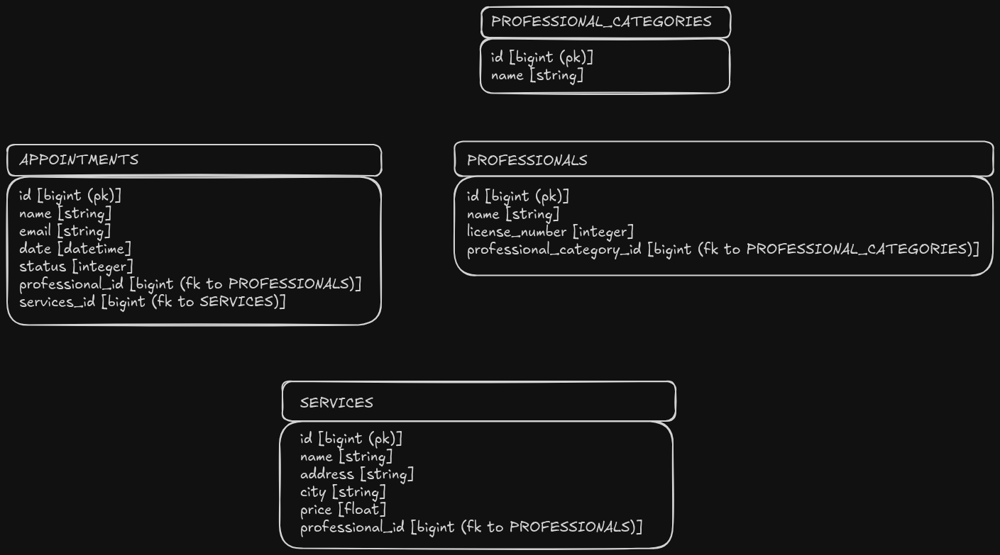

<div align="center">
    
    <h1>Nutrium Code Challenge</h1>
</div>

Implementation of the code challenge pruposed by Nutrium.

## 📜 Table of Contents

- [Features](#features)
- [Getting Started](#getting-started)
- [Setup](#setup)
- [Usage](#usage)
- [Running Tests](#running-tests)
- [Deployment](#deployment)

## ⚡ Features

### Core Requirements

#### Guest Flow

- [x] A guest can search nutritionists by:
  - [x] Nutritionist's name.
  - [x] Name of service provided.
- [x] A guest can request an appointment with a selected nutritionist by:
  - [x] Providing their name and email.
  - [x] Selecting a date and time.
- [x] A guest can only have one pending request at a time. (commented because it
      makes other rule pointless)
- [x] Once a request is submitted, it will be marked as pending until is either
      accepted or rejected by a nutritionist.
- [x] If a request is accepted, all **other pending requests** for the same
      guest **at the same time date and time** must be automatically rejected.
- [x] Guests should receive an email notification when their request is answered
      (accepted or rejected).

#### Nutritionist Flow

- [x] A nutritionist can view a list of appointment requests.
- [x] The nutritionist can **accept or reject** each request.
- [x] When a decision is made, the guest is notified via email.

### Pages to Implement

#### 1. Nutritionist Search Page

- [x] Similar to the presented mockup.
- Includes:
  - [x] A search input (by name or service).
  - [x] A results list of matching nutritionists.
  - [x] A **"Schedule Appointment"** button for each nutritionist.
    - [x] Opens a modal to collect:
      - [x] Guest's name and email.
      - [x] Desired appointment date and time.
  - [x] A "Personal Page" button (this can be left as non-functional) placeholder.

#### 2. Pending Appointment Requests Page (Nutritionist View)

- [x] Similar to the presented mockup.
- [x] A page where the a nutritionist can view all incoming appointment
      requests.
- [x] **Must be implemented using a Javascript Framework (React recommended)**
- [x] Authentication is not required.
- For each request, show:
  - [x] Guest information.
  - [x] Request date/time.
  - [x] Actions: **Accept** or **Reject**.
- [x] Trigger email notification to the guest when the request is answered.

### Extra-Mile Features (Optional)

- [x] **Testing:** Implement testing strategy (unit, feature...) for implemented
      features.
- [x] **Caching:** Implement a caching strategy for nutritionist search.
- [x] **Advanced Search:** Use external search engines or tools to enchance
      search capabilities.
- [x] **Utility-First CSS:** Use frameworks like TailwindCSS for styling.
- [x] **Internationaliztion (i18n):** Support for multiple languages.

### Utilities

- [x] Submit your solution as a **public Git repository** (GitHub, GitLab,
      Bitbucket).
- [x] Include a `README.md` file with:
  - [x] Setup instructions.
  - [x] How to run the application.
  - [x] Any other relevant notes or decisions.
- [x] Include _seeds_ that:
  - Create multiple nutritionists.
  - Assign services with different prices and locations.
  - Allow search functionality to be tested immediatly.

## 🚀 Setup

### Prerequisists

Ensure you have the following installed:

- Ruby (version 3.3.7)
- Rails (version 8.0.2)
- Node.js (npm or yarn) for managing JS dependencies
- Docker (in order to run PostgreSQL and Elasticsearch)

### Setup the environment

Some helper scripts are included in order to make it easir to get the project up
and running.

In order to run the project you basically have to have all dependencies
installed, have a PostgreSQL instance running in localhost, as well as an
Elasticsearch. Also, you must have the schema loaded in the database as well as
the searching indexes created and populated in Elasticsearch.

In order to get all of this setup run the following commands:

```bash
# Install ruby dependencies
bundle install

# Install javascript dependencies
npm install

# Setup PostgreSQL and Elasticsearch instances
bin/env/start

# If, for some reason you want to destroy your development environment and start
# again, just run the following commands.
bin/env/destroy
bin/env/start

# Force the schema on to the database and populate it with data
bin/rails db:migrate
bin/rails db:seed
```

## How to run the application

```bash
bin/dev

# Visit the application at http://localhost:3000

# Nutritionist page is at http://localhost:3000/professionals (http://localhost:3000 redirects to http://localhost:3000/professionals)

# Appointments page is at http://localhost:3000/appointments
# Query parameters are available:
#  - professional_id (integer) [in order to filter by nutritionist id]
#  - status (integer) [in order to filter by status (0 - pending; 1 - accepted; 2 - rejected)]
```

## Notes

## Database schema

<div align="center">
    
</div>

## Technologies

- [Ruby on Rails](https://rubyonrails.org/), as the main web framework.
- [Inertia.js](https://inertia-rails.dev/guide/), as the glue between the rais
  controllers.
- [React.js](https://react.dev/) for the frontend.

## Caching strategy

When a search is made, the controller layer stores the result of the query in an
entry with keyname `professionals_search_{#search_term}` (in memory, since we
are in a development environment and nothing more complex is required). This
cache entry is then valid for 2 minutes. If, in the 2 minutes that follow the
write action in the cache a request, a search request with the same search term
is received, the application will return the result stored in the cache. This
mechanism can reduce significantly the amount of times is hit to form the
response to a request, reducing latency in response times (to this request) and
potentially reducing latency in other requests, due to the reduced load on the
database.

## Advanced Search

Used elasticsearch to help with the searches, created indexes for both
"professionals" and "services".

The "professionals" index is composed by the following fields:

- `name` (since the advanced search is supposed to search for the professionals name).
- `license_number` (simply because I took the liberty of adding, because I
  though it makes sense in the use case.).
- `service_names` (since the advanced search is supposed to provide the
  capability to search for the service names of the services provided by the
  desired nutritionist).

## Utility-First CSS

Use tailwindCSS and headless UI for some components.

## Internationalization (i18n)

Is supported.
